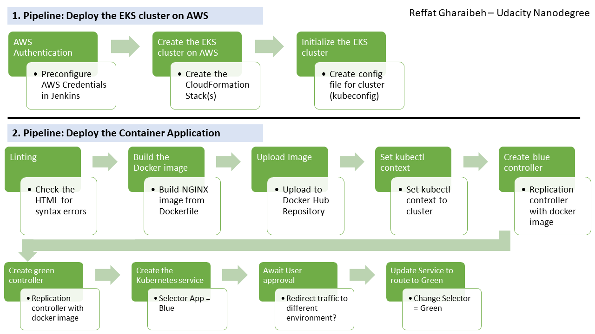

# Udacity Capstone Project - Cloud DevOps Engineer 

This is the final project of the Udacity Cloud DevOps Engineer Nanodegree. 
It showcases the relevant knowledge and required skills for the Cloud DevOps space.

## Project Tasks include:

* Working with AWS Cloud
* Using Jenkins to implement CI / CD
* Jenkins installed on AWS hosted EC2 instance (Ubuntu 18.04)
* Building pipelines
* Blue/Green Deployment Strategy
* AWS CloudFormation to programmatically deploy clusters
* Setup AWS EKS clusters
* Build NGINX webserver Docker image from Dockerfile
* Building and deploying Docker containers

## About this Project: 

CI/CD pipelines for a basic website that will be deployed to an AWS EKS cluster (Blue/Green Deployment).




## Project files:
```sh
* /application-deployment : Deployment Script of Containers Pipeline file
* /clusters-deployment : CloudFormation Script of Cluster Pipeline file 
* /Images : All screenshots showing installation and execution.
* Jenkinsfile : Jenkinsfiles for Pipeline creation
* Dockerfile : Dockerfile for building the NGINX image 
* green-controller.json : Create a replication controller green pod
* green-service.json : Create the green service
* blue-controller.json : Create a replication controller blue pod
* blue-service.json : Create the blue service
* index.html : Web site HTML file.
```
## Tool Requirements:

Installation requriements for CI/CD Pipeline:

* Jenkins (requries JAVA)
* Blue Ocean Plugin
* Pipeline-AWS Plugin
* Docker
* Add jenkins user to Docker Group
* AWS Cli V2 (V1 installed via pip is not sufficient)
* kubectl
* eksctl
* tidy

